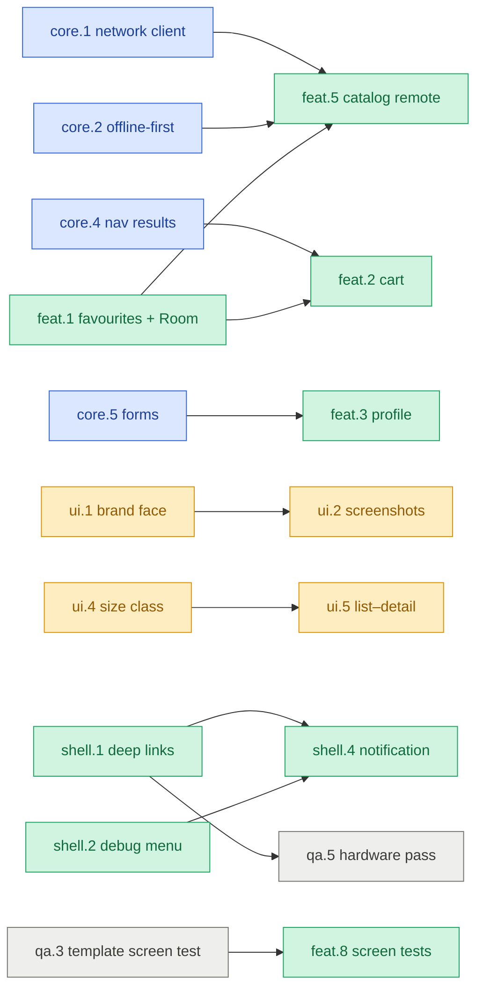

# Plan

Plan 3. The single work list for this template: what is open, who may work on it in parallel,
and what needs a decision. `CLAUDE.md` is the rulebook, `README.md` the orientation,
`scripts/README.md` the generators. History lives in git, not here — Plan 2 in full is
`git show 3dde6e2:docs/PLAN.md`, and every landed item is one commit named `<id> <title>`.

## Status

**Updated:** 2026-09-09 · **Gate:** doctor 23/23 · test_scripts 45 · ktlint clean · build green
**Coverage:** 38 % lines — architecture and ViewModels tested; data layers 0 %, components 10 %
**Repo:** 26 modules + `build-logic` · 41 components · 5 sample features + `template` · 10 scripts

| Track | Owns | Done | Progress |
|---|---|---|---|
| **core** · the reusable architecture | `service/`, `core/di`, `build-logic/` | 5 / 6 | `████████░░` 83 % |
| **ui** · design system and adaptive | `core/ui`, `feature/gallery` | 1 / 5 | `██░░░░░░░░` 20 % |
| **app** · shell and sample features | `app/`, `feature/*` | 4 / 14 | `███░░░░░░░` 29 % |
| **quality** · tests, CI, release | `.github/`, `.maestro/`, `scripts/`, `feature/template`, `docs/` | 3 / 7 | `████░░░░░░` 43 % |
| **Total** | | **13 / 32** | `████░░░░░░` 41 % |

**Start now — nothing is blocked and nothing waits on a decision.** Highest value first:
`feat.5` (the catalog goes remote — `core.1` + `core.2` + `feat.1` are all in), `feat.2` (cart, the
only consumer of `core.4`), `ui.2` (screenshot goldens, now that `ui.1` bundled the face), then
`feat.3` / `feat.4` / `shell.3` / `shell.5` for breadth, and the cheap ones — `feat.6`, `qa.7`,
`qa.8`, `qa.10` — whenever a short slot appears.

**Two need something a session cannot do alone:** `qa.2` wants the Maestro **CLI**
(`brew install mobile-dev-inc/tap/maestro` — `brew install maestro` gives the Electron cask, which
has no `maestro test`), and `qa.5` wants the physical device. `feat.1`'s device pass shows the
`adb` + `uiautomator dump` fallback works well on the emulator: every `testTag` in this repo comes
through as a `resource-id`, so `login_submitButton` and friends are directly addressable.

**Picking this up in a fresh session:** this file is the whole handoff. Read it, pick an item,
`git worktree add ../<repo>-<id> -b <id>-<slug>`, **copy `local.properties` in** (it is gitignored,
and without it every Gradle task fails with "SDK location not found"), work, run the gate, commit
as `<id> <title>`, fast-forward merge, remove the worktree. `main` is one commit per item.

Legend · size `S` under an hour, `M` half a day, `L` a day or more · risk `stable` known-good
libraries, `plugin` adds a Gradle plugin (check its AGP range before writing code), `alpha`
pre-release library, `device` needs an emulator or hardware, `decision` waits on a Q or D.

## Questions

None open. Q1–Q7 were answered 2026-09-09 and became D19–D29; a new one goes here with the next
number, and only its own items wait on it.

## Decisions

A decision with a default is taken when its item starts; say so before then to change it.
D1–D12 are Plan 2's, made 2026-09-08, and stand.

| | Decision | Outcome |
|---|---|---|
| D1 | `gateway` module | Merged into `data` |
| D2 | Splash | SplashScreen API, no minimum hold |
| D3 | `UiState.loading` | Defaults to `null` |
| D4 | Convention plugins | Yes, and they own the shared dependencies |
| D5 | AGP | Stable 9.x |
| D6 | Navigation 3 | Migrated, no spike |
| D7 | Network and database | Ktor client + Room |
| D8 | Crash reporting | Interface + logging default; no vendor SDK in the repo |
| D9 | Screenshot tool | Compose Preview Screenshot Testing — **superseded by D14** |
| D10 | Material 3 Expressive | No, standard M3 |
| D11 | Design system | KSD, imported as three layers |
| D12 | Dynamic colour | Removed, not defaulted off |
| D13 | Brand face | **Default: bundle Source Sans 3.** Previews and goldens need a face that renders without network, a POS device may have no Play Services, and 300–500 kB is nothing. Fetching the OFL-licensed TTFs into the repo is part of the item |
| D14 | Screenshot tool, second try | **Default: Roborazzi.** Runs under the Robolectric 4.16 that already works here, no alpha plugin, and scans the previews that exist rather than duplicating them. If the compatibility check fails within an hour, park it like 4.1 |
| D15 | End-to-end tool | **Default: Maestro.** `CLAUDE.md` already writes its syntax and every screen carries the ids |
| D16 | Component gallery in prod | **Default: no.** It moves under the debug menu (`shell.2`) and R8 drops it from `prod` |
| D17 | Merge policy for worktrees | **Default: one PR per item, rebase-merged, CI required.** `main` keeps one commit per item |
| D18 | Room wiring | **Default: a `convention.android.room` plugin** (Room + KSP), applied beside `convention.feature.data` by the modules that need it |
| D19 | Q2 · Template or product | **Template.** The four generic sample features stand, `feature/template` and the generators keep earning their cost, `ui.4` / `ui.5` stay where they are |
| D20 | Q1 · What the sample talks to | **Ktor `MockEngine` fixtures on the `dev` flavor.** No server to keep alive and CI runs it unchanged. The cost is that "offline" is a fixture told to fail, not a real network drop — `feat.5`'s Verify line says so rather than pretending otherwise |
| D21 | Q5 · Hardware | **A physical device exists.** `qa.5` stays scheduled behind `shell.1` |
| D22 | Q6 · Licence | **None.** The repo stays all rights reserved — `qa.1` struck. Reconcile with D19 if it is ever published: a template nobody may legally fork is a template in name only |
| D23 | Q7 · Sample features | **All four stand** — favourites, cart, profile, search |
| D24 | Q3 · Locales | **English and Czech, hand-written.** No spreadsheet pipeline: it would need a new script, which the scope rule forbids, and five features do not justify amending that rule. `feat.9` adds the `values-cs` files |
| D25 | Q5 · Branch protection | **Not possible.** The repo is private on the free plan, so required checks cost money — `qa.9` struck. CI still reports on every PR; nothing enforces it |
| D26 | Renovate | **Not now, not refused.** `renovate.json` stays in the repo, configured and ready; the GitHub app is simply not installed, so nothing runs. `qa.6` moves to the backlog rather than being dropped — dependency churn is most expensive while four worktrees are open, and the config costs nothing sitting there. Recorded honestly: Renovate is a GitHub bot, not a dependency — it ships no code — so this was about noise and timing, not the vendor rule below |
| D27 | Vendor policy | **Prefer official and widely used.** Google, JetBrains and androidx first; then a large company with broad adoption. Anything else needs a line here, and if it ships in the APK, a first-party alternative that was actually tried. Written into `CLAUDE.md` so it survives this plan |
| D29 | Q4 · Theme | **The hand port stands.** No Style Dictionary and no Node in this repo. The accepted cost is drift: a KSD token change is re-ported by hand, and nothing detects it. Promote the generator from the backlog the first time that actually hurts |
| D28 | D27 applied, 2026-09-09 | **Stands:** Koin (the one shipping exception — 23 files deep, Hilt migration is a plan of its own), Coil (no first-party image loader exists), Roborazzi (D14 — Google's tool has been `0.0.1-alpha` for two years, alpha03 July 2024 → alpha16 July 2026, and duplicates previews rather than scanning them), Maestro (D15 — never enters the app or the build). **Goes:** mockk and `dependency-analysis` (`qa.10`); Chucker is never added |

## What Plan 2 taught

Fifty items landed in one day. Where the time went, and the rule each cost bought:

| Cost | Rule in this plan |
|---|---|
| ~2 h of the day on alpha Gradle plugins meeting AGP 9 + Gradle 9 + JDK 25 | Every item carries a risk tag. A `plugin` or `alpha` item starts with a compatibility check and gets 30 minutes to a green spike before it is parked |
| The plan grew to 1,140 lines, most of it notes on finished items; every session paid to read it | An item is four lines. A landed item keeps its Done line; the commit and PR hold the story |
| Coverage: 38 % overall, data layers 0 %, components 10 % | An item that adds code names its tests in its Verify line and ships them in the same commit |
| Device checks by hand through `adb` and `uiautomator dump` | Maestro flows over the ids that already exist (`qa.2`); hardware for what an emulator cannot settle (`qa.5`) |
| One agent, one branch, one item at a time | Four tracks with disjoint file ownership, so four worktrees can run at once |
| One open decision (D13) held the last Phase 3 item for the whole plan | Every D has a default. Only a Q waits, and a Q blocks only its own items |
| Full `./gradlew build` some thirty times per item | Iterate on the module task; run the gate once, before the commit |

## How to work this plan

**Worktrees.** One per item, on a branch named after it:

```bash
git worktree add ../<repo>-core.1 -b core.1-network
```

Rebase on `main` before the PR. PR title is `<id> <title>`; rebase-merge, so `main` stays one
commit per item. Branch protection with the three CI jobs required was dropped — D25.

`local.properties` is gitignored, so a fresh worktree has no SDK path and every Gradle task fails
with "SDK location not found" before it compiles anything. Copy it in as the first thing you do:

```bash
cp ../<repo>/local.properties .
```

**Shared files.** These are edited by more than one track, always additively — a new line, never
a rewrite. On a conflict keep both sides and run `doctor.py`; it checks every one of them.

| File | Who appends |
|---|---|
| `settings.gradle.kts`, `core/di/build.gradle.kts`, `core/di/Koin.kt`, `app/AppNavHost.kt`, `app/KoinGraphTest.kt`, the module tree in `CLAUDE.md` | any item that adds a feature or screen — the generators do it |
| `gradle/libs.versions.toml` | any item that adds a library |
| `build-logic/` | core track; `feat.1` adds one plugin file, `ui.3` one dependency line |
| `app/TopLevelDestination.kt` | `feat.2` adds a tab |
| this file | every item, its own line and the dashboard |

An item that must edit a file its track does not own says so in its Done line; nobody else has an
open item on that file at the same time.

**Item lifecycle.** `[ ]` → `[~]` when started (add the id to *Start now*) → `[x] (date)` when
the gate is green and the PR is merged; refresh the track row and the total, one `█` per 10 %.
`[-]` drops an item with one line saying why. New item: next number in its track. If what shipped
differs from the Done line, one **Landed:** sentence — not a paragraph.

**The gate,** in the order CI runs it:

```bash
python3 scripts/doctor.py && python3 scripts/test_scripts.py && ./gradlew ktlintCheck && ./gradlew build
```

**Environment,** checked 2026-09-09 on this machine, because four `device` items assume it:
`adb` lives at `~/Library/Android/sdk/platform-tools/adb` and is not on `PATH`; one AVD exists
(`medium_phone_1`), so `ui.4` and `ui.5` need a tablet profile created before their Verify lines
can run; `gh` and `maestro` are not installed, and `qa.2`, `qa.6`, `qa.9` and D17's
one-PR-per-item flow all want them.

**Scope rules that stand.** No new scripts; an existing one changes only when something else
forces it, as part of that item. A `service/` module never references `:core:*`, `:feature:*` or
`:app`. A feature composes from `:core:ui` and never draws. Do not build a data layer against
invented data — that is what Q1 is for.

## Dependencies

Arrows are "must land first". Everything not drawn is independent and can start today.



Independent: `core.3` `core.6` `ui.3` `shell.3` `shell.5` `feat.4` `feat.6` `feat.7` `qa.1`
`qa.2` `qa.4` `qa.6` `qa.7` `qa.8` `qa.9`.

---

## Track core · the reusable architecture

Owns `service/`, `core/di`, `build-logic/`. Every item here is API the app track then uses;
nothing here knows a feature.

- [x] **core.1 `:service:network` — Ktor client** (2026-09-09) · L · `stable`
  Why: nothing crosses a network. The reusable half — client, error mapping, auth, refresh — is
  API-agnostic.
  Done: module on Ktor **3.5.2** with `api(projects.service.core.domain)` only; `HttpClient` factory
  (JSON, timeouts, logging on debug) **taking its engine as a parameter**, which is what lets D20's
  `MockEngine` replace it on `dev`; HTTP status → `DomainError` table; bearer auth behind a
  `TokenStore` interface with single-flight refresh; request logging through **Ktor's own `Logging`
  plugin** rather than Chucker, per D28 — Android Studio's Network Inspector covers the rest;
  `create_datasource.py --remote`
  emits the Ktor-backed variant (was 7.16); `export_service.py` picks the module up unedited.
  Verify: `MockEngine` tests for every row of the mapping table and for two parallel 401s causing
  one refresh; a `test_scripts.py` case for `--remote`; the `Logging` plugin absent from `prodRelease`.
  **Landed:** the module is **Kotlin/JVM, not an Android library** — nothing in it touches
  `android.*`, so the compiler enforces the portability rather than a convention, exactly as
  `:service:core:domain` does. It is also flat rather than layered: one port to the outside world
  has no domain/data split to make, so it is registered with `includeModule(":service:network",
  "service/network")`.
  Three things the Done line was wrong about:
  · **`export_service.py` did not pick it up unedited.** Its discovery only recognised
  `service/<name>/<layer>`, so a flat module was invisible and silently not copied. Fixed here:
  an empty layer list now means flat, and `settings_snippet` prints `includeModule` for it.
  `doctor.py` needed the same — its settings parser matched `include("…")` but not
  `includeModule("…", "…")`, so the new module read as unregistered.
  · **The `Logging` plugin cannot be "absent from `prodRelease`"** the way Chucker was: it is an
  ordinary library dependency, not a `debugImplementation`. What is actually controlled is that
  `HttpClientFactory` installs it only when a `Logger` is passed, and `NetworkConfig.logBodies`
  gates headers and bodies — both off unless a caller asks. That is the guarantee; the wording
  promised something the dependency graph cannot give.
  · `create_datasource.py --remote` needed **repository templates of its own**. The existing pair
  is written against `observeValue`/`setValue`, which a Ktor source does not have, so `--remote
  --repository` would have generated a repository that does not compile. It now emits a matching
  `get(id)` pair plus the domain model it returns.
  Single-flight is a mutex plus a token comparison rather than a shared `Deferred`: a waiting
  caller re-reads the store and takes what the winner saved, so a cancelled caller cannot cancel
  the refresh another one is waiting on. Six tests cover it, including five parallel callers.

- [x] **core.2 Offline-first combinator** (2026-09-09) · M · `stable`
  Why: was 6.2's first half. Cache-then-network is the shape every remote-backed screen needs.
  Done: `BaseRepository.cached(local: Flow<T?>, remote: suspend () -> T, write: suspend (T) -> Unit)`
  emitting cache, then remote, then the refreshed cache; a remote failure over a stale cache emits
  the data plus a failure the screen can show inline. Pure JVM — `local` is any flow.
  Verify: `BaseRepositoryTest` cases for hit, miss, stale-on-failure, and remote-then-local order.
  **Landed:** seven cases, not four — writing them found a real defect. The cache is read as a
  snapshot (`local.first()`) and then collected live, and `distinctUntilChanged` on the live flow
  cannot see the snapshot, so whenever the refresh wrote a value equal to what was already there
  the same data was emitted twice and every screen redrew for nothing. The combinator now compares
  against the last value *emitted* rather than the last the cache produced. `local` is `Flow<T?>`
  on purpose: `null` is a cache miss, while an empty list is a cached empty list.

- [x] **core.3 Lifecycle-aware `observe`** (2026-09-09) · S · `stable`
  Why: was C8. `observe {}` collects for the ViewModel's whole life, including backgrounded. Fine
  for DataStore, wrong for a socket or a location stream.
  Done: `observe(flow, whileSubscribed = true)` collects the source only while `state` has a
  subscriber, with a 5 s grace; the KDoc says which variant to reach for.
  Verify: `BaseViewModelTest` shows the source is cancelled when the last collector leaves and
  re-collected when one returns.
  **Landed:** the subscriber count is `uiState.subscriptionCount`. `state` is
  `uiState.asStateFlow()`, a view sharing the same accounting, so collecting the state a screen
  renders is what keeps the source alive. A `stateIn` of the source — the obvious first attempt —
  counts the collector `observe` itself creates, which lives as long as the ViewModel and so never
  drops; it compiles, reads correctly and does nothing.
  Two `distinctUntilChanged`s, not one. The second, *after* the grace delay, is what makes a
  rotation free: a collector returning inside the window makes `transformLatest` cancel the pending
  `false` and re-emit `true`, and `flatMapLatest` would take that repeated value as a reason to
  restart the source — the exact teardown the grace period exists to prevent. Six tests, one of
  which asserts the default `observe` still collects with no subscriber at all.

- [x] **core.4 Navigation results** (2026-09-09) · M · `stable`
  Why: was 7.2. No pattern for "pick something on screen B, return it to A", so it gets reinvented
  per feature. Navigation 3 has no `previousBackStackEntry` to lean on.
  Done: `service/core/ui/navigation/` — a result store keyed by the requesting entry, a
  `rememberNavResult<T>()` for the requester and `setNavResult(value)` for the responder, surviving
  process death through the saved-state decorator; documented in `CLAUDE.md`'s navigation recipe.
  The worked example is `feat.2`'s product picker.
  Verify: a Robolectric test round-trips a value across a push and pop; the pattern needs no
  `SavedStateHandle` in any ViewModel.
  **Landed:** the requester's half is **`NavResultEffect(key) { }`**, not `rememberNavResult()`.
  It returns Unit, and a Unit-returning composable is PascalCase — lint's `ComposableNaming`
  fails the build on the other spelling, and `LaunchedEffect` is named the way it is for the same
  reason. The responder's half is `rememberNavResultSender(key)`, which does return a value.
  The store is a `rememberSaveable` **above** the entries in `AppNavHost` rather than the
  saved-state decorator the Done line named: a decorator is per entry, and the entry that has to
  survive is precisely the one being popped. It edits `app/AppNavHost.kt`, which this track does
  not own — nothing else had an open item on that file.
  Two fixes it forced: `consume` was being called *during composition*, so a discarded composition
  would have swallowed the user's selection — it now peeks in composition and consumes in the
  effect. And `doctor.py`'s modifier check exempted `*Provider` but not Compose's own `ProvideX`
  idiom. `convention.android.library.compose` also gains the Compose test rule and Robolectric, so
  `:core:ui` and `:service:core:ui` can assert what they draw — **`ui.3` no longer has to add
  them**.

- [x] **core.5 Form validation** (2026-09-09) · S · `stable`
  Why: was C10. `LoginState.canSubmit` and `SignUpState.canSubmit` are hand-rolled booleans that
  cannot say *why* submit is disabled.
  Done: `service/core/ui/form/` — `FieldState(value, error: UiText?, touched)`, validators
  (`required`, `email`, `minLength`), and a `Form` that derives `canSubmit` and the first error;
  `LoginState` and `SignUpState` migrate to it (edits `feature/auth/presentation`, app track's directory).
  Verify: JVM tests per validator; `LoginScreenTest` and both auth ViewModel tests unchanged and
  green; the error text appears under the field in the Login preview.
  **Landed:** the auth tests could not stay *unchanged* — the field type is the thing that changed,
  so `LoginState.PREVIEW.copy(email = "")` stops compiling by construction. Two edits, both
  behaviour-preserving: `LoginScreenTest` uses a new `LoginState.EMPTY` fixture, and
  `SignUpViewModelTest`'s passwords got longer because sign-up gained a real `minLength(8)` and
  `"hunter2"` is seven characters — the test is about matching, so it should not fail on length.
  `touched` is the reason `FieldState` is a type rather than a `String`: a form must not shout at
  someone who has not typed yet, so a value is validated from the first keystroke but the error
  stays hidden until the field is touched. `Form.touchAll` is there for the submit that has to
  reveal everything at once. `matches` takes `() -> String` rather than a value, because a confirm
  field is checked against whatever the other field holds *now*.
  A fifth validator was not added: `email` is deliberately permissive — the only way to know an
  address is real is to send to it, and a strict pattern rejects valid ones.

- [ ] **core.6 Analytics seam** · M · `stable`
  Why: was 7.4. Screen views are the one event every product wants, and the only place that knows
  every screen is `AppScaffold(screenId)`.
  Done: `Analytics` in `:service:core:domain` (`screen(id)`, `event(name, params)`), a logging
  default bound in `coreModule`, a `LocalAnalytics` in `:service:core:ui`; `AppScaffold` reports
  `screenId` once per entry (one call added in `core/ui`, ui track's directory); vendor recipe
  next to the crash-reporting one in `CLAUDE.md`.
  Verify: a Robolectric test that composing a scaffold twice reports one view; every sample screen
  passes `screenId` — `doctor.py` gains that check.

## Track ui · design system and adaptive

Owns `core/ui` and `feature/gallery`. `ui.5` also edits `app/AppNavHost.kt` and the catalog
destinations; no app-track item touches those while it is open.

- [x] **ui.1 Bundle the brand face** (2026-09-09) · S · `decision` D13
  Why: was 3.8. The scale is right and the face is `FontFamily.Default`.
  Done: Source Sans 3 in weights 400/600/700/800 under `core/ui/src/main/res/font/`;
  `AppFontFamily` points at them; the APK delta recorded in this line.
  Verify: every `@ScreenPreview` renders the face offline; `aapt2 dump badging` size before and after.
  **Landed: one variable font, not four static weights.** The four the scale asks for — 400, 600,
  700, 800 — are 1.6 MB as separate Adobe TTFs, because each carries Latin, Greek and Cyrillic.
  `SourceSans3[wght].ttf` is 646 kB on disk, **233 kB in the APK** after deflate, and covers every
  weight from 200 to 900. `minSdk` is 29 and variable fonts need 26, so nothing had to move.
  `prodRelease` is 3.5 MB with it in.
  The `wght` axis is set explicitly per weight rather than left to the default: without it a
  device that cannot apply variations synthesises the weight instead, and 600 and 700 render
  identically. The OFL is committed at `licenses/SourceSans3-OFL.txt` — the repo has no licence of
  its own (D22), but a bundled third-party face still needs its own.
  Verified by a Robolectric test rather than by eye: it asserts the family is not
  `FontFamily.Default` and that text composes with no network, which is the situation a preview
  and a golden are in. A silent fallback to the platform face is the failure this catches.

- [ ] **ui.2 Screenshot tests with Roborazzi** · M · `plugin` D14 · needs ui.1
  Why: was 4.1. 41 components × three variants and ten screens × twelve renders sit unasserted.
  Done: compatibility check first — Roborazzi **1.74.0** and `ComposablePreviewScanner` **0.9.3**
  are both current and stable (checked 2026-09-09), so the spike is only the toolchain: AGP 9.4,
  Gradle 9.6, JDK 25, Robolectric 4.16. Roborazzi
  applied through `convention.android.library.compose`; `ComposablePreviewScanner` records every
  `@ComponentPreview` and `@ScreenPreview` without duplicating them; goldens committed;
  `verifyRoborazziDebug` in the CI build job.
  Re-tested against D27 on 2026-09-09 and kept — see D28; both dependencies are build-only and
  reach no release build.
  Verify: break one padding value on purpose and the verify task fails on that image only; restore.

- [ ] **ui.3 Component behaviour tests** · M · `stable`
  Why: `core/ui/component` is 1,689 lines at 10 % coverage. Previews show; nothing asserts.
  Done: the dependencies are already there — `core.4` added them to
  `convention.android.library.compose`. Tests for the interactive components — `AppButton` (loading keeps width, disabled
  emits nothing), `AppTextField` (error always carries text), `AppCheckbox` (indeterminate),
  `AppSelect`, `AppTabs`, `AppStepper`, `AppSheet`, `AppDialog`.
  Verify: the package leaves 10 % in the Kover report; each test finds by `testTag`, never by text.

- [ ] **ui.4 Window size class drives density** · S · `stable`
  Why: `AppTheme.density` has a `SizeClass` and nothing sets it; a tablet gets the phone scale.
  Done: `AppTheme` reads `currentWindowAdaptiveInfo()` and picks compact or regular density and
  typography from it; previews gain a tablet variant.
  Verify: the tablet preview shows regular typography and the 56 dp touch target.

- [ ] **ui.5 List–detail for the catalog on wide screens** · M · `stable` · needs ui.4
  Why: was 7.10's useful half. The source system runs on tablets; the catalog is exactly a
  list-detail shape.
  Done: `adaptive-navigation3` **1.3.0**, stable as of 2026-09-09 — the `alpha` tag this item
  carried is retired, and only its Navigation 3 range still wants checking against the catalog's
  1.1.7; a `ListDetailSceneStrategy` on the `NavDisplay`; products and product detail carry the metadata;
  phones unchanged.
  Verify: emulator tablet profile shows both panes, phone profile one; process death four screens
  deep restores on both.

## Track app · shell and sample features

Owns `app/` and `feature/*` except `gallery` and `template`. `shell.*` is the app shell;
`feat.*` is one feature per item, each proving one capability the architecture has and no sample
uses. Each feature is a worktree of its own — they meet only in the registration files.

- [ ] **shell.1 Deep links** · M · `device`
  Why: was 7.1. Getting the back stack right on a cold-start deep link is the part people get wrong.
  Done: a `VIEW` intent filter on `MainActivity` for `<app>://product/{id}`, the scheme named
  after the app; a
  `DeepLinks.kt` in `:app` parsing a URI into a `NavKey`; a cold start builds Home → Categories →
  Products → Detail so Up walks back; a warm start pushes onto the current tab.
  Verify: `adb shell am start -d <app>://product/croissant` cold and warm, both land on
  the product with Up working; a `MainViewModelTest` case for the synthesised stack.

- [ ] **shell.2 Debug menu, dev and staging only** · M · `stable` D16
  Why: was 7.5's useful half. Flavor, base URL, session and "crash now" are what a tester needs,
  and the gallery has no business in a prod build.
  Done: `:feature:devmenu` (presentation, di) reached from Settings when a `prod` source set's
  `DebugMenu.enabled` is false and the others' is true, so R8 strips it; shows build info,
  `BASE_URL`, session, `ErrorTracker` test crash, LeakCanary and Chucker launchers; Components
  moves here from Settings.
  Verify: `prodRelease` mapping file contains no `feature.gallery` or `feature.devmenu` class;
  a `SettingsScreenTest` case for the entry present and absent.

- [ ] **shell.3 Theme setting** · M · `stable`
  Why: light / dark / system is the first preference every app grows, and no sample shows a
  preference read at the root.
  Done: `:feature:settings` gains `domain` and `data` (`--layers domain,data --force`) with a
  `ThemePreference` in Preferences DataStore; a segmented control on Settings; `MainActivity`
  applies it through `AppTheme(darkTheme = …)`.
  Verify: `SettingsViewModelTest` and a screen test; the choice survives a restart on the emulator.

- [ ] **shell.4 Notification tap-through** · S · `device` · needs shell.1, shell.2
  Why: the channel exists and nothing posts to it.
  Done: the debug menu posts a notification whose `PendingIntent` carries a product deep link.
  Verify: tapping it from a cold start lands on the product with Up working.

- [ ] **shell.5 Onboarding flow** · M · `stable`
  Why: a third flow beside auth and main, gated by a stored flag, is the shape of every first-run
  screen and the one flow switch the template does not show.
  Done: `:feature:onboarding` full stack with a `seen` flag in DataStore; `MainViewModel` combines
  it with the session into `Unknown / Onboarding / SignedOut / SignedIn`; the splash holds through
  `Unknown`; three pages on an `AppPager` added to `:core:ui` with `create_component.py` (one
  new file in the ui track's directory).
  Verify: `MainViewModelTest` for all four states; first cold start shows onboarding then Login,
  the second skips it.

- [x] **feat.1 Favourites — proves Room** (2026-09-09) · M · `plugin` D18
  Why: Room was chosen (D7) and nothing uses it; `SnackbarAction` is API nobody raises.
  Done: `convention.android.room` in `build-logic/` (Room **2.8.4** + KSP **2.3.11**, versions in
  the catalog; KSP decoupled from the Kotlin version at 2.3.0 — last coupled release was
  `2.2.21-2.0.5` — so nothing has to match Kotlin 2.4.20, checked 2026-09-09, and the spike that
  remains is KSP against AGP 9.4 on the JDK 25 daemon); `:feature:catalog:data` gets a `CatalogDatabase` with products
  seeded from the in-memory list and a favourites table; a heart on product detail; a Favourites
  section on Home (Home depends on catalog `domain`, which is allowed); remove with an undo snackbar.
  Verify: a DAO round-trip test under Robolectric; ViewModel tests; a `ProductDetailScreenTest`
  tap toggles the heart; favourites survive a restart.
  **Landed:** the spike passed — KSP 2.3.11 and Room 2.8.4 run on AGP 9.4 / Gradle 9.6 / JDK 25,
  `kspDebugKotlin` and `copyRoomSchemas` both execute, so **D18 stands** and `feat.2` and `feat.5`
  can build on it. Four things are worth knowing:
  · The database owns **categories and products**, not products alone. Seeding half the catalog
  would have left `getCategories` on a list and `getProducts` on SQL, and `feat.5` has to replace
  both from the network anyway.
  · Seeding runs **on first read**, not in a `RoomDatabase.Callback`: the callback cannot suspend
  and runs on whichever thread opened the database, so it would need its own scope and a second
  set of insert paths. `productCount() == 0` is one cheap query and is reachable from a test.
  · `favourites` has **no foreign key** to `products`. `feat.5` replaces the product table on every
  refresh and a cascade would delete the user's favourites with it; an orphaned favourite simply
  fails to join, which is asserted.
  · `FakeFavouritesRepository` lives in `testFixtures` of `:feature:catalog:domain`, beside the
  interface it fakes, because `:feature:home` needs it too. `:feature:catalog:domain` gains
  `java-test-fixtures`, as `:feature:auth:domain` already had.
  Device-checked on the emulator: seed loads, the heart flips, the favourite is still on Home after
  `force-stop` and a cold start, and the undo snackbar puts a removed favourite back.

- [x] **feat.2 Cart — proves cross-feature domain, tab badge, plurals, nav results** (2026-09-09) · L · `stable` · needs core.4, feat.1
  Why: `toPluralUiText` and `AlertPayload` are unused API; no feature depends on another's domain.
  Done: `:feature:cart` full stack on its own Room database; add from product detail; a Cart tab
  with a count badge (`TopLevelDestination` gains an optional badge flow); quantity on
  `AppStepper`; "N items" through `toPluralUiText`; remove with undo; checkout → confirm dialog →
  clear; "Add item" opens the catalog in picker mode and the product comes back through core.4.
  Verify: ViewModel tests including the plural at 1, 2 and 5; a screen test; the badge updates
  from another tab.
  **Landed:** the picker is a **screen of its own** (`ProductPicker`, generated with
  `--with-args resultKey:String`) rather than the catalog in a mode. Categories is a tab key and a
  `data object`, so it cannot carry a result key, and pushing a tab root as a modal would confuse
  `currentTab`. The picker reads the cache the tabs already filled — one `observeAllProducts`
  query — so it shows what has been browsed and fetches nothing.
  **A cart line is denormalised, not joined.** `feat.5` replaces the catalog table on every
  refresh, so a joined cart would empty itself when the shop reorganised. The user keeps what they
  put in the basket, at the price they saw.
  Two defects found on device, both invisible to the compiler:
  · **A `UiText` passed as a format argument was not resolved** — it reached `String.format` as an
  object, and the checkout dialog read "Plural(id=…, quantity=3, args=[3]) will be ordered".
  `UiText` now resolves nested arguments, which is the fix for every future composed string too.
  · The badge's flow was **built inside composition**, so it resubscribed every time the bar
  redrew. Lint caught it; `remember` fixes it.
  Device-checked end to end on the emulator: add twice from product detail → badge shows 2 → cart
  reads "2 items" and $9.00 → Add item → picker → Tea → back at "3 items" → Checkout → "Place this
  order?" → Order → empty cart.

- [ ] **feat.3 Profile — proves PermissionGate and forms** · M · `device` · needs core.5
  Why: `PermissionGate` and `PermissionRationale` ship unused; no sample has a form with rules.
  Done: `:feature:profile` full stack, DataStore-backed; name and e-mail on `FieldState`; avatar
  from the Photo Picker (no permission) or the camera behind `PermissionGate(CAMERA)`; shown with
  `AppImage`; reached from Settings.
  Verify: ViewModel tests for every validator path; a screen test; on the emulator deny the camera
  twice and the gate shows the settings rationale while the picker still works.

- [ ] **feat.4 Search — proves inline error per content id** · M · `stable`
  Why: 0.12 made inline retry work per content id and no screen has two content states.
  Done: a search screen from the Categories top bar; `AppSearchField` with a 300 ms debounce and
  `flatMapLatest`; results and recent searches as two content ids, each with its own inline
  error and empty state; recents in DataStore.
  Verify: ViewModel test with `advanceTimeBy` for the debounce and one for a failure on one id
  leaving the other; a screen test.

- [x] **feat.5 Catalog over the network** (2026-09-09) · M · `stable` D20 · needs core.1, core.2, feat.1
  Why: was 6.1's second half. The first remote-backed feature.
  Done: `RemoteCatalogDataSource` on `core.1`, DTOs and mappers in `data`, `DefaultCatalogRepository`
  on `core.2` writing into `feat.1`'s database; JSON fixtures in `dev`'s source set behind a
  `MockEngine` that takes a failure toggle, so the stale-cache path can be exercised by hand;
  `BuildConfig.BASE_URL` names the fixture host, so a screen still never writes a URL.
  Verify: repository tests on `MockEngine` for hit, miss and stale; on `dev`, load once, flip the
  toggle, browse from cache. Airplane mode proves nothing here — the engine is in-process.
  **Landed:** `CatalogRepository` is now **Flow-based**. Cache-then-network cannot be bolted onto a
  `suspend fun` that returns once, so the interface changed and the three catalog ViewModels moved
  from `execute` to `observe`. The seed is gone: the database is filled by the network, and the
  `dev` fixtures are the seed's replacement.
  Four things this turned up:
  · **`observe` never registered an inline retry** — only `execute` did. Every offline-first screen
  would have shown a "Try again" button that does nothing. `BaseViewModel.observe` now has the
  same contract.
  · **`ErrorDisplay.Inline` replaces the content**, so a refresh failure over a stale cache wiped a
  usable list off the screen — the opposite of what offline-first is for. Both list ViewModels now
  claim that error with `keepStaleContent` and raise a snackbar instead, so stale beats empty.
  · `@Serializable` was inert in `data` modules: `convention.feature.data` never applied the
  serialization plugin, and the failure arrives at runtime as "Serializer not found", a long way
  from the cause. Fixed in the plugin.
  · `null` versus an empty list is load-bearing in the cache: `LocalCatalogDataSource` returns
  `null` for "never fetched" and a list for "fetched, and empty", or a genuinely empty category
  re-fetches on every collection.
  Device-checked on the emulator: the catalog shows `Pantry` and `Hot chocolate`, which exist only
  in the fixture JSON; then `run-as … touch files/fail_network`, force-stop, cold start — and the
  categories are still there with "Showing saved items". The toggle is a file rather than a flag
  precisely so it can be flipped from outside the process; `shell.2`'s debug menu is where it gets
  a switch.

- [x] **feat.6 Session carries an id; `setUser` wired** (2026-09-09) · S · `stable`
  Why: `ErrorTracker.setUser` has nothing to be called with, and the docs say so instead of the code.
  Done: `Session(id, email)`; the mock login mints an opaque id; `MainViewModel` calls
  `setUser(id)` on sign-in and `setUser(null)` on sign-out; an old encrypted session reads as
  signed out rather than crashing.
  Verify: `MainViewModelTest` asserts both calls; `AesGcmAeadTest` unchanged.
  **Landed:** the id is **random, not a hash of the address**. A hash is still the address to
  anyone holding a list of addresses, and this value is going to a crash reporter.
  "An old encrypted session reads as signed out rather than crashing" is a **version prefix** on
  the stored string, not a parse attempt: an unrecognised format is not decoded, it is discarded.
  Throwing would turn "you upgraded the app" into a crash loop on launch, and the worst a null
  costs is one sign-in. An absent file, an undecryptable one, an empty one and a foreign format
  now all read the same way, so there is still no third case.
  `MainViewModel` reports on the session flow rather than at the login call site, because that is
  the one place that knows — including the failure path, which clears the user too. A
  `FakeErrorTracker` joins the fixtures beside `ErrorTracker`, and records a *list* of users:
  asserting only the latest value would pass even if sign-out never sent `null`.
  `DefaultAuthRepository`'s Koin binding is spelled out rather than `singleOf`, because the
  constructor has a defaulted id generator and reflection would try to resolve a `Function0` from
  the graph.

- [ ] **feat.7 Tests for the data layers that exist** · M · `stable`
  Why: `feature/*/data` is 84 lines at 0 %, the cheapest coverage in the repo.
  Done: `DefaultAuthRepository`, `DefaultLocalAuthDataSource` (in-memory DataStore + `AesGcmAead`,
  no Keystore), `DefaultCatalogRepository`, `DefaultLocalCatalogDataSource`.
  Verify: none of the four packages reads 0 % in the Kover report.

- [ ] **feat.8 A screen test for every existing screen** · M · `stable` · needs qa.3
  Why: `LoginScreenTest` is the pattern and nine screens do not follow it.
  Done: SignUp, Categories, Products, ProductDetail, Home, Settings, Permissions, Gallery and
  GalleryDetail, each in the shape `qa.3` generates — renders the fixed state, finds by tag,
  asserts the event a tap emits. **Then tighten `doctor.py`**: `SCREEN_TEST_SUFFIXES` gains
  `ScreenTest` and the unit check becomes eight files. `qa.3` left that out on purpose — until
  these nine exist the check reports nine failures and reddens every worktree's gate — so it is
  this item's own verification, and the last commit in it.
  Verify: `./gradlew test`; `doctor.py` green only once all nine are written; each test fails when
  its screen's tag is renamed on purpose.

- [ ] **feat.9 Czech alongside English** · M · `stable` D24 · needs feat.1–feat.8
  Why: D24 chose two locales, and Czech has four plural forms (one / few / many / other) against
  English's two — so a second locale is what actually proves `toPluralUiText` rather than
  decorating it. Last in the track on purpose: translating strings for features not yet written
  is waste.
  Done: `values-cs/strings.xml` in every `presentation` module, `:core:ui` and `:service:core:ui`
  (whose `core_*` strings ship to consumers, so they carry the translation too); hand-written, no
  pipeline; `%d` and `%s` positions preserved.
  Verify: every `<string>` and `<plurals>` name in `values/` has a `values-cs/` counterpart;
  the cart's "N items" reads correctly at 1, 2 and 5 under `cs`; no screen clips at Czech's
  longer words.

## Track quality · tests, CI, release

Owns `.github/`, `.maestro/`, `scripts/`, `feature/template`, `docs/`, `LICENSE`,
`baselineprofile/`.

- [-] **qa.1 LICENSE** — dropped, D22. No licence wanted; the repo stays all rights reserved.

- [x] **qa.2 Maestro golden-path flows** (2026-09-09) · M · `device` D15
  Why: every device check so far went through `adb` by hand.
  Done: `.maestro/` flows for sign in → Home, browse to a product, log out, grant a permission,
  all by `id:` and never by text; how to run them in `README.md`; CI left for later.
  Note before starting: `brew install maestro` installs the **cask** — an Electron GUI app with no
  CLI — and `brew trust mobile-dev-inc/tap` does not change that. `maestro test` needs the CLI from
  the tap formula (`brew install mobile-dev-inc/tap/maestro`) or the vendor's install script.
  `feat.1`'s device pass fell back to `adb` + `uiautomator dump`, which works: the tags this repo
  puts on every screen come through as `resource-id`, so `LoginScreen`, `login_submitButton` and
  `home_favouriteRemoveButton` are all directly addressable.
  Verify: `maestro test .maestro` passes on the emulator; a flow fails when its tag is renamed.
  **Landed:** five flows, 5/5 passing in 2m38s — sign in, browse to a product and favourite it,
  add to cart and check out, log out, grant a permission. The CLI is
  `brew install mobile-dev-inc/tap/maestro` (2.10.0); `brew install maestro` gives a desktop app
  with no `maestro test`, and Homebrew does not link the formula's binary, so it lives at
  `$(brew --prefix maestro)/bin/maestro`.
  Two gaps the flows found, both fixed here:
  · **Settings and the permissions screen carried no `testTag`s at all**, so nothing on them could
  be addressed by id. They do now.
  · **The shared alert dialog published no ids.** A dialog is its own window, so it does not
  inherit `AppScaffold`'s `testTagsAsResourceId` — the tags existed in Compose's tree and were
  invisible to anything driving the device. `StateAlertDialog` now sets it and exposes
  `alert_dialog` / `alert_confirmButton` / `alert_declineButton`. This is the failure the item was
  worth having: the log-out flow matched "Log out" by text and tapped the settings button *behind*
  the dialog, which is precisely why CLAUDE.md says find by id and never by text.

- [x] **qa.3 The template ships a screen test** (2026-09-09) · S · `stable`
  Why: the seven-file unit has a ViewModel test and no screen test, so every generated screen
  starts without one.
  Done: `TemplateScreenTest` and `TemplateArgsScreenTest` in `feature/template`, cloned by
  `create_screen.py` and `create_feature.py`; the unit is eight files; `test_scripts.py` follows;
  `CLAUDE.md`'s screen table gains the row.
  Verify: generate a throwaway feature, its screen test runs and passes, `delete_feature.py`
  leaves the tree byte-identical.
  **Landed:** two things differ from the line above. First, the template screen had **no
  interactive element** — `TemplateEvent` was an empty interface — so there was no "what a tap
  does" to clone. It gains a counter, an `IncrementClicked` event the ViewModel handles, and three
  tags; every generated screen now starts from a worked example rather than an empty sealed
  interface. Second, **`doctor.py` was deliberately not tightened.** Requiring `XScreenTest` of
  every screen reports nine failures today — exactly `feat.8`'s nine — which would turn the gate
  red in every parallel worktree; the check moves into `feat.8`, where it becomes that item's own
  verification. A third change was forced: a test tag's stem is camelCase (`productReview_saveButton`)
  while the resource beside it is snake_case, and the existing rules rewrote tags to
  `product_review_saveButton` in the screen and mismatched them in the test. `_common.py` gains
  `rewrite_test_tags`, called by both generators before the resource rules.
  A fourth was a pre-existing bug this item tripped over: the pre-commit hook runs
  `test_scripts.py`, git sets `GIT_DIR` and `GIT_INDEX_FILE` for every hook, and those leak into
  the `git` calls the tests make inside their temp copy — `git init` initialising the real gitdir,
  `git status` reporting the in-progress commit as a dirty tree so `init_project.py` refuses. Eight
  tests failed under the hook and passed when run by hand. `test_scripts.py` now strips `GIT_*`
  from every subprocess environment, so the hook works on exactly the commits it exists to check.

- [ ] **qa.4 Generator output compiles in CI** · M · `stable`
  Why: was 7.15. `test_scripts.py` checks text; a template change that breaks generated code is
  found by the next user.
  Done: `test_scripts.py --with-gradle` generates a feature in the temp copy and compiles its
  presentation module; run on the weekly schedule job only.
  Verify: break `feature/template` on purpose and the weekly job fails.

- [ ] **qa.5 Hardware pass** · M · `device` Q5 · needs shell.1
  Why: the Keystore path, the startup benchmark and predictive back have never run outside an
  emulator, and the emulator ANRs.
  Done: on a physical device — session round trip through the real Keystore; `StartupBenchmark`
  with and without the profile, numbers recorded in this line; predictive back on every screen;
  "Don't keep activities" four screens deep; a cold deep link; TalkBack through Login and Catalog.
  Verify: the numbers, and one line per check here.

- [-] **qa.6 Renovate runs** — parked, D26. Moved to the backlog, not dropped: `renovate.json`
  stays and is finished work, so finishing the item later is one click plus a config line.

- [ ] **qa.7 `resourcePrefix` per feature** · S · `stable`
  Why: was K4. `CLAUDE.md` asks for `user_profile_` prefixes and nothing enforces them.
  Done: `convention.feature.presentation` derives `resourcePrefix` from the module path;
  `:core:ui` sets `app_`; existing strings already comply.
  Verify: add an unprefixed string on purpose and lint fails.

- [ ] **qa.8 Compose compiler metrics** · S · `stable`
  Why: was I6. `@Immutable` is everywhere; whether anything is still unstable is a guess.
  Done: `composeCompiler { metricsDestination / reportsDestination }` behind `-PcomposeMetrics`
  in the compose convention plugin; the first report read and any unstable parameter fixed.
  Verify: the report lists every `XState` as stable.

- [-] **qa.9 Required checks on `main`** — dropped, D25. Private repo on the free plan, so branch
  protection is unavailable. D17's one-PR-per-item still holds by convention, unenforced.

- [x] **qa.10 Retire mockk and `dependency-analysis`** (2026-09-09) · S · `stable` D28
  Why: mockk is in the `testing` bundle every module gets, for one usage in `UiTextTest.kt`;
  `dependency-analysis` is advisory, one-maintainer, pinned behind this AGP, and `CLAUDE.md`
  already documents which of its output to ignore.
  Done: `UiTextTest.kt`'s one mock rewritten as a hand-written fake, matching the rest of the repo;
  both entries gone from `libs.versions.toml`, the `testing` bundle and the root `build.gradle.kts`;
  the `buildHealth` section removed from `CLAUDE.md` and `README.md`.
  Verify: `./gradlew test` green; `doctor.py`'s hardcoded-coordinate check still passes.
  **Landed:** `UiTextTest` was not rewritten with a hand-written fake — `Context` and `Resources`
  are framework classes and faking them by hand is worse than mocking them. It runs under
  Robolectric against the **real** resource table instead, which is a better test than the one it
  replaces: the mock could only assert that `getQuantityString` was called with the arguments the
  test had just passed it, while the real table catches the mistake that matters — quantity and
  argument being confused for one another. Four cases now, up from three.

## Backlog

Parked, not scheduled. Promote by moving into a track with the next number.

- Renovate (`qa.6`, parked by D26) — **the config is already written and stays in the repo.**
  `renovate.json` groups androidx, kotlin, koin and AGP into one PR each and skips pre-releases,
  and every version lives in `libs.versions.toml`, so the version-catalog manager is the only one
  with anything to do. What is missing is only the GitHub app, at `github.com/apps/renovate`.
  Promote it when Plan 3's items are done and a bump landing on `main` no longer rebases four
  worktrees. Consider `"dependencyDashboardApproval": true` on the first run — Renovate then opens
  nothing on its own and keeps one issue listing what is stale, which is the low-noise way in.
- Feature-owned nav graphs (was 7.3) — the `--graph` grouping in `AppNavHost` does the job today.
- Logger backend and remote config (the rest of 7.5).
- `doctor.py --fix` (7.6) — only when a check's fix is mechanical. `create_service.py` (7.7) and
  `check_strings.py` (7.8) stay parked under the no-new-scripts rule.
- Localisation pipeline (7.9) — parked by D24: two hand-written locales need no generator. The
  per-app language picker is still worth having and is unblocked; promote it when someone wants it.
- Theme generated from KSD tokens — parked by D29, not refused; promote it the first time a token
  change has to be re-ported by hand. Replaces the `:core:designsystem` split (7.10).
- ViewModel-readable permission state (7.13) — build inside the first feature that needs it.
- Module graph rendered and layer rules asserted at build time (was K3).
- WorkManager sync and Paging 3 — once `feat.5` has a server to sync with and a list longer than
  a page.
- Baseline profile regenerated on release tags.
- detekt, when 2.x is stable. Compose Preview Screenshot Testing, if D14 fails and it leaves alpha.
- `explicitApi()` on the `service/` modules.

Dropped: ADRs and a release doc (7.11) — the Decisions table is the record and `CLAUDE.md`'s
Commands section is the release doc. Undecoded Plan 1 codes (7.14) — decoded from the review:
C8 → `core.3`, C9 done (2.7), C10 → `core.5`, H7 done (5.6), I6 → `qa.8`, K3 → backlog,
K4 → `qa.7`.

## Done before this plan

| Plan | When | Landed |
|---|---|---|
| Plan 1 · 33 items | 2026-09-07 | The four P0 defects, `Outcome` / `BaseRepository` / `BaseViewModel`, `Screen()` owning navigation and commands, inline states, the generator suite, `doctor.py`, CI |
| Plan 2 · Phase 0 · 14 | 2026-09-08 | Docs match code; the review's small defects fixed |
| Plan 2 · Phase 1 · 8 | 2026-09-08 | Convention plugins, plain-JVM domains, AGP 9.4 / Kotlin 2.4.20, ktlint, shared fixtures, `gateway` merged into `data` |
| Plan 2 · Phase 2 · 8 | 2026-09-08 | Navigation 3, SplashScreen API, `SessionState`, tabs with per-tab history, transitions, permissions, snackbar action, plurals |
| Plan 2 · Phase 3 · 9 of 10 | 2026-09-08 | KSD design system in three layers, 41 components, every screen composed from them, accessibility and test ids, the gallery, three `doctor.py` checks |
| Plan 2 · Phase 4 · 3 of 4 | 2026-09-08 | Preview variants, the screen-test pattern, coverage report |
| Plan 2 · Phase 5 · 8 | 2026-09-08 | Flavors, signing, `ErrorTracker`, LeakCanary, gitleaks, baseline profile, release CI, encrypted session |

Carried over: 3.8 → `ui.1`, 4.1 → `ui.2` (tool changed, D14), 6.1 → `core.1` + `feat.5`,
6.2 → `core.2` + `feat.1`, 7.x as listed in the backlog.
