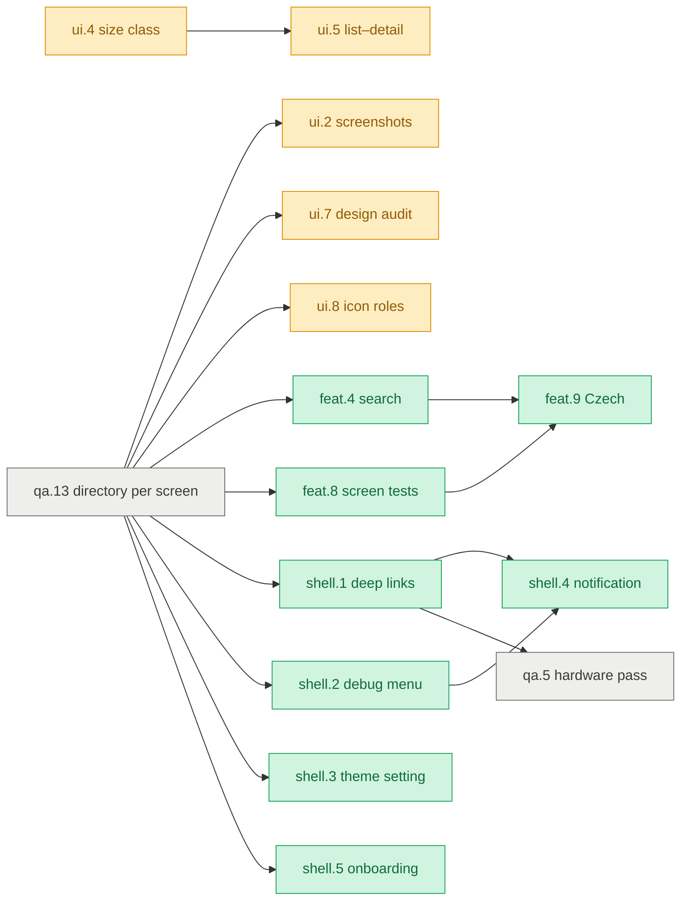

# Plan

Plan 4, the board: what is open, who may work on it in parallel, and what needs a decision — one
line per item. Each item's Why / Done / Verify, the working rules and the reasoning behind the
decisions are in [PLAN-DETAIL.md](PLAN-DETAIL.md); a fact lives in one of the two files, never
both. `CLAUDE.md` is the rulebook, `README.md` the orientation, `scripts/README.md` the
generators. History lives in git: Plan 3 in full is `git show dff021c:docs/PLAN.md`, and every
landed item is one commit named `<id> <title>`. The division of this plan between four parallel
workers, and the brief for the agent that merges their pull requests, is
[PLAN-WORKERS.md](PLAN-WORKERS.md).

## Status

**Updated:** 2026-09-09 · **Gate:** doctor 23/23 · test_scripts 45 · ktlint clean · build green
**Coverage:** 55.6 % of lines, measured 2026-09-09 at `dff021c` — refresh with
`./gradlew koverXmlReport` and write the commit beside the number
**Repo:** 34 modules + `build-logic` · 6 sample features + `template` · 13 screens ·
42 components · 275 tests · 5 Maestro flows · 10 scripts

| Track | Owns | Done | Progress |
|---|---|---|---|
| **core** · the reusable architecture | `service/`, `core/di`, `build-logic/` | 0 / 5 | `░░░░░░░░░░` 0 % |
| **ui** · design system and adaptive | `core/ui`, `feature/gallery` | 1 / 8 | `█░░░░░░░░░` 13 % |
| **app** · shell and sample features | `app/`, `feature/*` | 0 / 9 | `░░░░░░░░░░` 0 % |
| **quality** · tests, CI, release | `.github/`, `.maestro/`, `scripts/`, `feature/template`, `docs/` | 0 / 8 | `░░░░░░░░░░` 0 % |
| **Total** | | **1 / 30** | `░░░░░░░░░░` 3 % |

**Where this plan comes from.** Plan 3 closed at 15 of 32 on 2026-09-09. The 17 it left open
keep their ids. Thirteen are new: from the health brief of the same day (`core.7` `core.8`
`core.9` `shell.6` `qa.11` `qa.12`), from the first person to tap a component in the gallery
(`ui.6`), from reading the KSD design documents against the code (`ui.7` `ui.8` `ui.9`
`core.10` `qa.14`), and from the decision to give every screen a directory (`qa.13`, D34).

**Start now.** **`qa.13` before anything that touches a screen** — it moves every
presentation package, so every screen item after it would otherwise rebase across a
rename. While it is open the parallel work is in the other directories: `core.7`, `core.8`,
`core.9`, `core.10`, `ui.3`, `ui.9`, `shell.6`, `qa.11`, `qa.12`, `qa.14`. Once it lands,
highest value first: `ui.2` (one word per preview unblocks it), `feat.8` (seven screens without
a screen test), `shell.2` (the gallery leaves prod), `ui.7`, `ui.8`; for breadth `feat.4`,
`shell.1`, `shell.3`, `shell.5`, `ui.4`; and `qa.7`, `qa.8` whenever a short slot appears.
Nothing scheduled waits on a decision.

**Waiting on you.** Q8 blocks only three backlog items. The design documents can be read through
Chrome without a login; `/design-login` from an interactive session is the tidier route.

**One branch carries unfinished work.** `ui.2-roborazzi` holds the Roborazzi wiring with its
blocker diagnosed — start there, not from scratch. `main` is clean and green without it.

Legend · size `S` under an hour, `M` half a day, `L` a day or more · risk `stable` known-good
libraries, `plugin` adds a Gradle plugin or CI action (check its range before writing code),
`alpha` pre-release library, `device` needs an emulator or hardware, `decision` waits on a Q or D.

## Questions

A question has no default and blocks only its own items.

| | Question | Blocks |
|---|---|---|
| Q8 | Will the sample ever talk to a real API, and when? Everything network-shaped is a fixture today. | backlog: certificate pinning, response caching, real token issuance |

## Decisions

A decision with a default is taken when its item starts; say so before then to change it.
D1–D29 stand from Plans 2 and 3; the reasoning behind the ones that need it is in the detail file.

| | Decision | Outcome |
|---|---|---|
| D1 | `gateway` module | Merged into `data` |
| D2 | Splash | SplashScreen API, no minimum hold |
| D3 | `UiState.loading` | Defaults to `null` |
| D4 | Convention plugins | Yes, and they own the shared dependencies |
| D5 | AGP | Stable 9.x |
| D6 | Navigation 3 | Migrated, no spike |
| D7 | Network and database | Ktor client + Room |
| D8 | Crash reporting | Interface + logging default; no vendor SDK in the repo |
| D9 | Screenshot tool | Compose Preview Screenshot Testing — superseded by D14 |
| D10 | Material 3 Expressive | No, standard M3 |
| D11 | Design system | KSD, imported as three layers |
| D12 | Dynamic colour | Removed, not defaulted off |
| D13 | Brand face | Source Sans 3, bundled as one variable font |
| D14 | Screenshot tool, second try | Roborazzi |
| D15 | End-to-end tool | Maestro |
| D16 | Component gallery in prod | No — it moves under the debug menu (`shell.2`) |
| D17 | Merge policy | One PR per item, rebase-merged; `main` is one commit per item |
| D18 | Room wiring | `convention.android.room`, applied beside `convention.feature.data` |
| D19 | Template or product | Template |
| D20 | What the sample talks to | Ktor `MockEngine` fixtures on the `dev` flavor |
| D21 | Hardware | A physical device exists; `qa.5` stays behind `shell.1` |
| D22 | Licence | None; all rights reserved |
| D23 | Sample features | All four stand: favourites, cart, profile, search |
| D24 | Locales | English and Czech, hand-written |
| D25 | Branch protection | Not possible on the free plan; CI reports, nothing enforces |
| D26 | Renovate | Configured in the repo, app not installed; parked |
| D27 | Vendor policy | Google, JetBrains, androidx first; then large and widely used; anything else earns a line here |
| D28 | D27 applied | Koin, Coil, Roborazzi and Maestro stay; mockk and `dependency-analysis` went |
| D29 | Theme | The hand port stands; no token pipeline until drift actually hurts |
| D30 | Maestro in CI | **Default: weekly schedule and on demand, not per pull request** |
| D31 | Versioning | **Default: name from the `v*` tag, code from the commit count; local builds keep 1 / 1.0** |
| D32 | Store upload | **Default: none.** A GitHub release carrying the APK is the release |
| D33 | Icon set | **Decided 2026-09-09: Material icons stay; the three sizes are `AppTheme.icons.sm/md/lg`.** The design names Lucide, which has no first-party Compose artifact |
| D34 | Presentation layout | **Decided 2026-09-09: a directory per screen, even a lone one, and a file per component in the feature's `component/`** |

## Dependencies

Arrows are "must land first". Everything not drawn is independent and can start today.

Independent: `core.6` `core.7` `core.8` `core.9` `core.10` `ui.3` `ui.9` `shell.6` `qa.4`
`qa.7` `qa.8` `qa.11` `qa.12` `qa.14`.

## Items

`[ ]` open · `[~]` started, with its branch · `[x] (date)` landed. One line each; the four-line
version of every open item is in the detail file under the same id.

### core · the reusable architecture

- [ ] **core.6 Analytics seam** · M · `stable` — `Analytics` in `:service:core:domain`, a logging
  default, `AppScaffold` reports each screen once
- [ ] **core.7 Room migrations are tested** · M · `stable` — `room-testing` in the Room plugin, a
  migration test per database, a version bump ships its migration in the same commit
- [x] (2026-09-09) **core.8 Retry with backoff on the client** · S · `stable` — Ktor's retry
  plugin for idempotent requests only, tested on `MockEngine`
- [x] (2026-09-09) **core.9 Permission helpers tested** · S · `stable` — Robolectric tests for the four
  statuses and the gate
- [x] (2026-09-09) **core.10 Format roles** · S · `stable` — money, weight, quantity, percent, time, date and
  duration as one set in `:service:core:ui`; the two `Price.kt` copies go

### ui · design system and adaptive

- [~] **ui.2 Screenshot tests with Roborazzi** · M · `plugin` D14 · branch `ui.2-roborazzi` —
  `.includePrivatePreviews()` is what the scanner was missing, not `internal` previews; what is
  left is where the test lives, the goldens, and the verify task in CI
- [ ] **ui.3 Component behaviour tests** · M · `stable` — the interactive components asserted by
  tag; the package leaves 22 %
- [ ] **ui.4 Window size class drives density** · S · `stable` — a tablet gets regular density
  and typography
- [ ] **ui.5 List–detail for the catalog on wide screens** · M · `stable` · needs ui.4
- [x] (2026-09-09) **ui.6 Gallery demos are interactive** · S · `stable` — every demo holds its
  own state, so a checkbox in the gallery toggles; a screen test proves it
- [ ] **ui.7 Components match the design's component document** · M · `stable` · needs qa.13 —
  each of the 42 audited against `03-Komponenty`; the gap table is written, the gaps are not closed
- [x] (2026-09-09) **ui.8 Icon roles** · S · `stable` D33 · needs qa.13 — `AppTheme.icons` with the three
  sizes; no icon size literal outside the theme
- [ ] **ui.9 Contrast is asserted** · S · `stable` — a JVM test over every text-on-surface and
  border-on-surface pair in both palettes, the design's check five

### app · shell and sample features

- [ ] **shell.1 Deep links** · M · `device` · needs qa.13 — `<app>://product/{id}` cold and
  warm, with Up working
- [ ] **shell.2 Debug menu, dev and staging only** · M · `stable` D16 · needs qa.13 — build
  info, session, crash test, the offline toggle as a switch; the gallery moves here and R8 drops
  it from prod
- [ ] **shell.3 Theme setting** · M · `stable` · needs qa.13 — light / dark / system, stored,
  applied at the root
- [ ] **shell.4 Notification tap-through** · S · `device` · needs shell.1, shell.2
- [ ] **shell.5 Onboarding flow** · M · `stable` · needs qa.13 — a third flow beside auth and
  main, behind a stored flag
- [x] (2026-09-09) **shell.6 Tests for the app shell** · S · `stable` — tab segments and the session switch;
  the package leaves 12 %
- [ ] **feat.4 Search — proves inline error per content id** · M · `stable` · needs qa.13
- [x] (2026-09-09) **feat.8 A screen test for every screen** · M · `stable` · needs qa.13 — the seven screens
  without one, then `doctor.py` requires it
- [ ] **feat.9 Czech alongside English** · M · `stable` D24 · needs feat.4, feat.8

### quality · tests, CI, release

- [ ] **qa.4 Generator output compiles in CI** · M · `stable` — on the weekly job
- [ ] **qa.5 Hardware pass** · M · `device` · needs shell.1 — Keystore, startup benchmark,
  predictive back, TalkBack
- [ ] **qa.7 `resourcePrefix` per feature** · S · `stable` — derived from the module path, lint
  enforces it
- [ ] **qa.8 Compose compiler metrics** · S · `stable` — every `XState` reported stable
- [ ] **qa.11 Maestro flows in CI** · M · `plugin` D30 — an emulator job on the schedule and on
  demand
- [ ] **qa.12 Version and release notes from the tag** · S · `stable` D31 — `versionName` and
  `versionCode` from the tag, a GitHub release with the APK and generated notes
- [x] (2026-09-09) **qa.13 A directory per screen, a file per component** · L · `stable` D34 — every
  screen's unit in its own sub-package, a feature's composables in `component/` one file each,
  the template and generators cloning that shape, two `doctor.py` checks holding it
- [x] (2026-09-09) **qa.14 Maestro ids exist in the code** · S · `stable` — a `doctor.py` check
  that every `id:` in a flow is a tag in the code, the design's check four

Backlog, lessons and the Plan 3 roll call are in [PLAN-DETAIL.md](PLAN-DETAIL.md).
