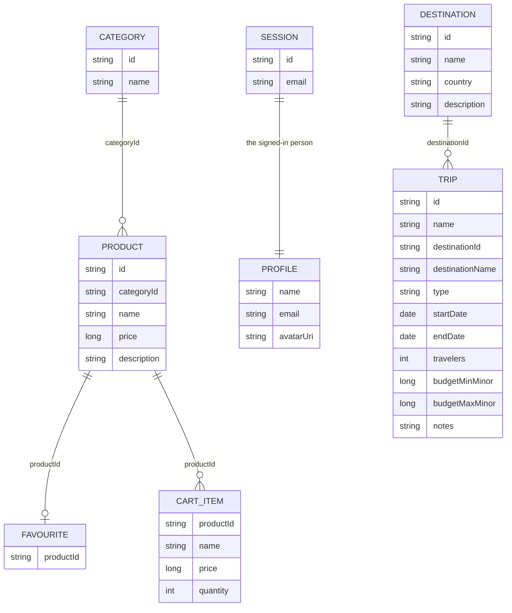

# Domain

The entities, what holds them, and what reads them. Every type here lives in a `domain` module —
a Kotlin/JVM module with no Android on its classpath.

## Entities

| Type | Module | Notes |
|---|---|---|
| `Category` | `feature/catalog/domain` | `id`, `name` |
| `Product` | `feature/catalog/domain` | `price` is a whole number of minor units; never a `Double` |
| `CartItem` | `feature/cart/domain` | carries `name` and `price` so a cart row survives a product going away; `lineTotal` is derived |
| `Session` | `feature/auth/domain` | `id` and `email`. The sample issues no token |
| `Tokens` | `feature/auth/domain` | the shape a real token pair would take; nothing issues one yet |
| `Profile` | `feature/profile/domain` | `avatarUri` is nullable; `Profile.EMPTY` is the blank one |
| `ThemePreference` | `feature/settings/domain` | `System`, `Light`, `Dark` |
| `AppLanguage` | `feature/settings/domain` | `System`, `English`, `Czech`, each with the BCP 47 `tag` the platform stores (`""` for the device's own); `fromTag` reads one back, an unknown tag being the default (D75) |
| `Destination` | `feature/trips/domain` | `id`, `name`, `country`, `description`; fixture data, seeded once |
| `Trip` | `feature/trips/domain` | `destinationId`/`destinationName` denormalized so a renamed destination cannot orphan a trip; `budgetMinMinor`/`budgetMaxMinor` follow `Product.price`'s convention; `status(today)` is derived, never stored |
| `Item` | `feature/inventory/domain` | something the user owns — `category`, `condition`, `quantity`, `priceMinor` (minor units, like `Product.price`), a nullable `acquiredOn`, `insured`, a `tags` set, `owner` (a name `AppAvatar` draws from), a nullable `imageUrl` the offline `dev` build never loads, `notes`. `ItemCategory`, `ItemCondition` and `ItemTag` are the closed sets a picker offers |

## Results and failures

`Outcome<T>` in `:service:core:domain` is the return type of every repository call: a success with a
value, or a failure carrying a `DomainError`. Nothing throws across a layer boundary.

`DomainError` is a sealed hierarchy, not a message: `NetworkError`, `ServerError`,
`UnauthorizedError`, `BadRequestError`, `NotFoundError`, `UnexpectedError`. Each
maps to its own wording in `:service:core:ui`'s error strings, so a feature never writes one.

## Repositories

Every method returns `Outcome`, and every observation is a `Flow<Outcome<T>>`.

| Repository | Module | Operations |
|---|---|---|
| `AuthRepository` | `feature/auth/domain` | `observeSession`, `login`, `logout` |
| `CartRepository` | `feature/cart/domain` | `observeItems`, `observeCount`, `add`, `setQuantity`, `remove`, `clear` |
| `CatalogRepository` | `feature/catalog/domain` | `observeCategories`, `observeProducts`, `observeAllProducts`, `searchProducts`, `getProduct` |
| `FavouritesRepository` | `feature/catalog/domain` | `observeFavourites`, `observeIsFavourite`, `setFavourite` |
| `RecentSearchesRepository` | `feature/catalog/domain` | `observeRecents`, `record`, `clear` |
| `OnboardingRepository` | `feature/onboarding/domain` | `observeSeen`, `markSeen` |
| `ProfileRepository` | `feature/profile/domain` | `get`, `save`, `setAvatar` |
| `ThemeRepository` | `feature/settings/domain` | `observeTheme`, `setTheme` |
| `LanguageRepository` | `feature/settings/domain` | `observeLanguage`, `setLanguage`; implemented in `:app`, not in the feature's data module (D75) |
| `TripsRepository` | `feature/trips/domain` | `observeTrips`, `getTrip`, `saveTrip`, `deleteTrip` |
| `DestinationsRepository` | `feature/trips/domain` | `observeDestinations`, `getDestination` |
| `InventoryRepository` | `feature/inventory/domain` | `observeItems`, `observeItem(id)`, `getItem`, `saveItem`, `deleteItems(ids)` |

## Use cases

A `domain` class, not a repository method, for the one case a repository cannot serve: an operation
another feature performs. A feature's `presentation` may depend on another feature's `domain` and
never on its `presentation`, so the use case is the seam — it holds the rule its own feature owns
and runs in the caller's scope.

| Use case | Module | What it does |
|---|---|---|
| `AddProductToCart` | `feature/cart/domain` | Product detail adds one of a product; the quantity of one is the cart's rule |

## What holds the data

A repository names a data-source interface and never its implementation, which is what makes the
store below swappable.

| Data source | Store |
|---|---|
| `LocalAuthDataSource` | DataStore, encrypted — the session is the one thing that is |
| `LocalCartDataSource` | Room · `CartDatabase` · `cart_items` |
| `LocalCatalogDataSource` | Room · `CatalogDatabase` · `categories`, `products`, `catalog_fetches` |
| `LocalFavouritesDataSource` | Room · `CatalogDatabase` · `favourites` |
| `RemoteCatalogDataSource` | Ktor, against `BuildConfig.BASE_URL`; `MockEngine` fixtures on `dev` |
| `LocalRecentSearchesDataSource` | DataStore |
| `LocalOnboardingDataSource` | DataStore — one boolean, and the whole first-run flow hangs off it |
| `LocalProfileDataSource` | DataStore |
| `AvatarDataSource` | the content resolver for reading, `filesDir` for the copy the app keeps |
| `LocalThemeDataSource` | DataStore |
| `AppCompatLanguageRepository` | AppCompat's per-app locale — `AppCompatDelegate` stores it below API 33, the platform's `LocaleManager` above; nothing in DataStore. In `:app`, beside the connectivity monitor |
| `LocalTripsDataSource` | Room · `TripsDatabase` · `trips`; `type` and the dates are `TEXT` through `Converters`, and an unknown type reads as `Leisure` rather than failing the list |
| `LocalDestinationsDataSource` | Room · `TripsDatabase` · `destinations`; seeded from a fixture list on first read, not a network fetch — no new dependency, D20 still stands |
| `LocalInventoryDataSource` | Room · `InventoryDatabase` · `items`; twelve fixture items seeded on first read, the way destinations are; the three enum columns, the date and the tag set are `TEXT` through `Converters`, an unknown name reading as a fallback |

Every database exports its schema under the module's `schemas/`, and a `version` bump ships its
migration and its migration test in the same commit. `fallbackToDestructiveMigration` is never used:
what it means is that the next update empties the cart. `TripsDatabase` is version 1 and carries no
migration yet — `TripsDatabase.MIGRATIONS` is where the first one goes.

`catalog_fetches` holds one row per cached list — `categories`, `products:<categoryId>` — written in
the same transaction as the rows. It is what makes a cached list `null` until it has been fetched and
a list, empty or not, afterwards, which is the distinction `BaseRepository.cached` rests on: an empty
table alone cannot say whether the category is empty or was never loaded.

## Session state

`SessionState` in `:app` — `Unknown`, `Onboarding`, `SignedIn`, `SignedOut` — is owned by
`MainViewModel` and is the only thing that switches between the auth and main flows. It is derived
from `AuthRepository.observeSession()` and `OnboardingRepository.observeSeen()`; the first passes a
retry count, because a flow whose collector outlives a failure otherwise stops emitting for good.
