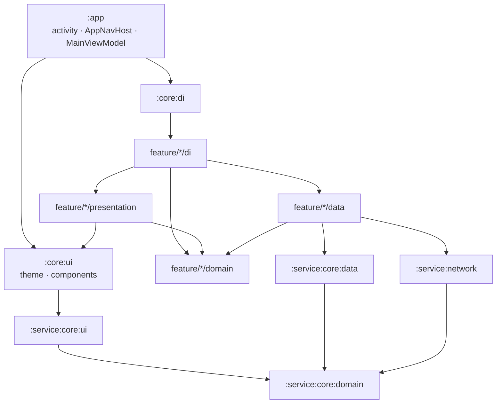
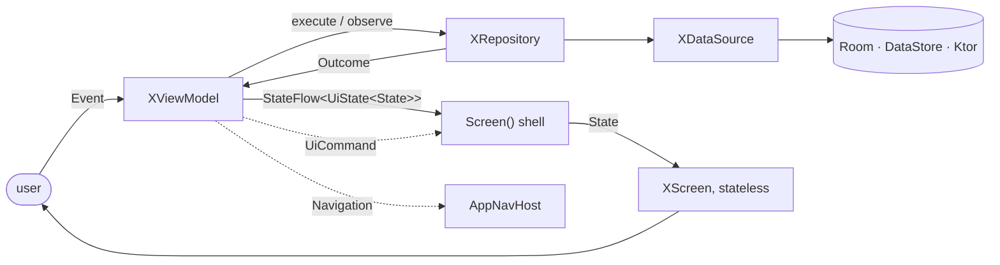
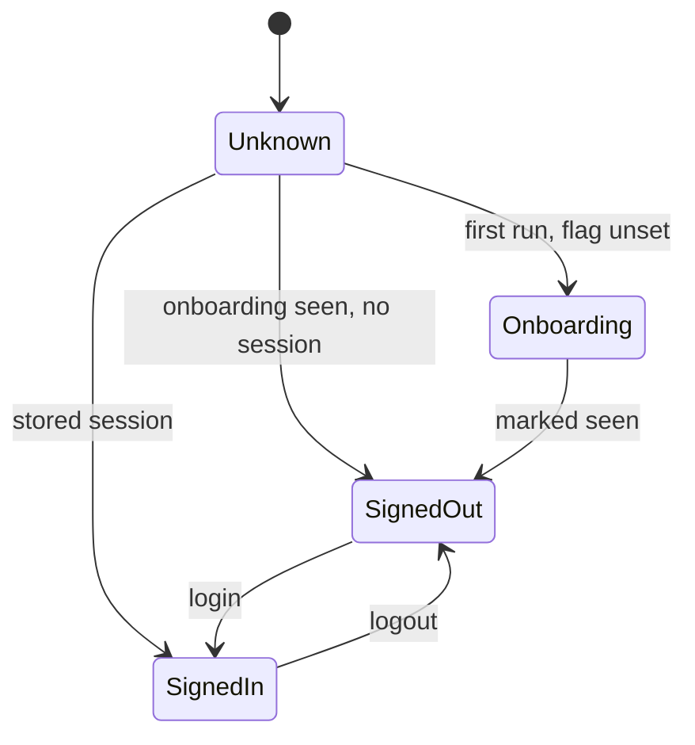

# Architecture

What the system is made of and how a value moves through it. The rules that follow from this are
[../../CLAUDE.md](../../CLAUDE.md); the steps for changing any of it are the recipes in
[../ARCHITECTURE.md](../ARCHITECTURE.md), which becomes `guides/RECIPES.md` in task A0P2. The module
names and the layer table are `CLAUDE.md` § Module structure until the same task moves them to
`spec/CODEBASE.md`.

## Layers

Clean architecture over MVI, single activity, type-safe Compose navigation, Koin for injection.
Dependencies point one way only.

`service/` is the reusable half: it knows nothing about this app's features, theme or object graph,
and is meant to be copied into another project directory-first. It therefore never references
`:core:*`, `:feature:*` or `:app`. `:service:core:domain` is a Kotlin/JVM module, so `android.*` is
not on its classpath and the compiler enforces the boundary.

A feature's `presentation` never depends on another feature's `presentation`. Crossing features is a
lambda parameter wired in `AppNavHost`; another feature's `domain` is an ordinary dependency.

## A screen

Six files in a directory named after the screen, plus two tests. The route key is `@Serializable`
and is the whole argument-passing mechanism: a screen that takes arguments takes them in its
constructor, never from an effect.

`Screen()` is the only collector in the app and the only interpreter of one-off commands. It renders
the loading overlay, the alert dialog and the error and empty states centrally, so a feature screen
only ever receives a non-null state and never reimplements any of them. Navigation intents and
commands are buffered channels rather than shared flows, so one emitted while nothing is collecting
arrives on resume instead of being dropped.

Failures are values. A repository returns `Outcome`, a view model calls it through `execute {}` or
`observe(flow = …) {}`, and those turn a failure into an alert or an inline retry and rethrow
cancellation. There is no `try`/`catch` in a view model.

## Navigation

Navigation 3 with a back stack of plain `NavKey` route keys, remembered by `rememberNavBackStack` on
the first frame — it is a `rememberSaveable`, so composing it later throws away the restored stack.

The four tabs do not own separate stacks. The one flat list **is** their concatenation in the order
the tabs were last visited: a tab's key starts a segment, selecting a tab moves that segment to the
end, and push and pop act on whichever segment is last. Per-tab history therefore survives process
death with no custom saver, and backing out of a tab's root lands on the previously visited tab.

Returning a value from one screen to another goes through `NavResultStore`, not a
`SavedStateHandle`: Navigation 3 has no previous-entry handle and a stack of plain keys has nowhere
to hang a value. The store is remembered above the display so it outlives the screen being popped,
and a result is consumed once.

## Session

`MainViewModel` owns the session and is the only thing that switches between flows. A screen changes
the session and lets it react; nothing navigates between the auth and main flows directly.

`Unknown` is what the splash screen holds; the back stack is composed unconditionally and the
display is gated instead.

## Environments

Two build types and three flavors on one `environment` dimension — `dev`, `staging`, `prod` — so a
variant is named `devDebug` or `prodRelease` and `assembleDebug` alone names nothing. `dev` and
`staging` carry an application-id suffix and their own launcher label, so all three install side by
side. `BuildConfig.BASE_URL` differs per flavor and no screen ever writes a URL. `dev` serves the
catalog from Ktor `MockEngine` fixtures, which is what the end-to-end flows run against.

A release is a tag: `versionName` is the tag without its `v`, `versionCode` is the commit count, and
any build not on a `v*` tag is 1 / `"1.0"`. The flavors, the SDK levels and the Java target are
defined once, in `build-logic`'s `ProjectConfig`.
